# deeperv4

Deeper V4

pip3 install -r requirements.txt

recommended install python 3.7.3

Deeper CR With Style 

Deeper V4 Fast Encryption With Progress bar 

Encrypting Files With Aes and Rsa Public And Private Keys 

Encrypt file or files in folder or subfolders or Partition

Auto Replace Spaces And Chars Like & () In Files 

Hide Keys

Deeper Cr Shell Mode:

Modes In Shell :

hash ,enc ,dec,hashhmac ,crackhash , 

New Mode :

zipcrack 

hash mode :

Hashing password with hashlib algorithms

enc mode:

Encrypt password with rsa  Public And Private Keys 

dec mode :

Decrypt passowrd 

hashhmac mode :

Hashing password with hashhmac algorithms

crackhash mode :

crack hash with dictionary and bruteforce attack 

zipcrack mode :

cracking zip file with dictionary and bruteforce attack 

Setup:

Run python3 setup.py install

Updating Tool 

run python3 updater.py

System

Linux Windows 

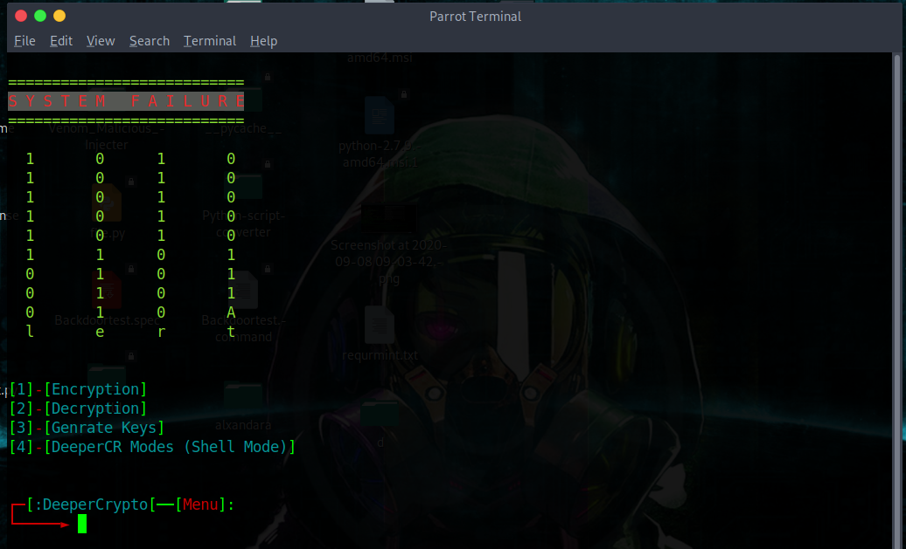   
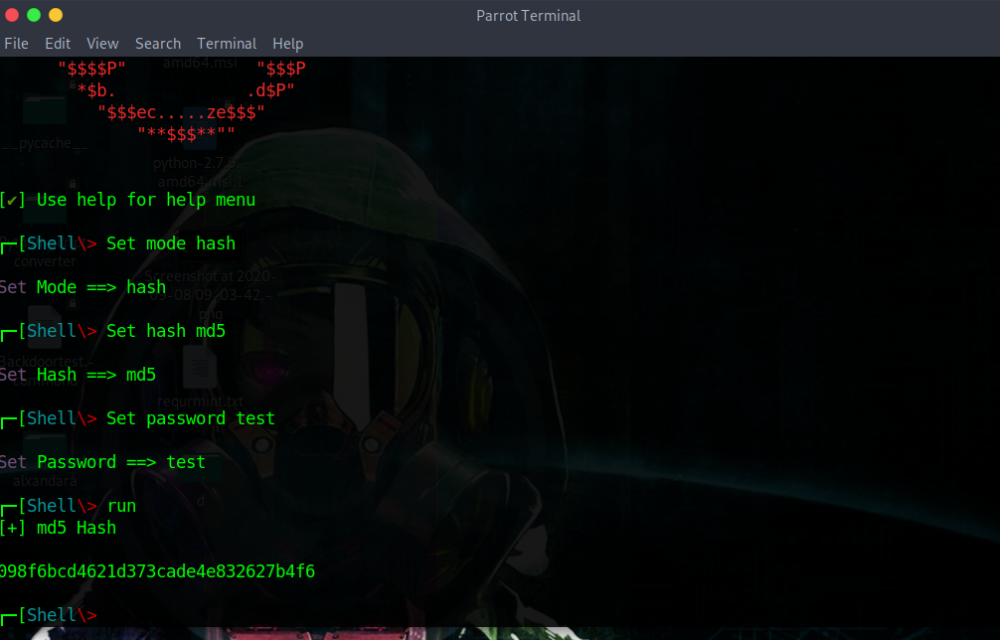
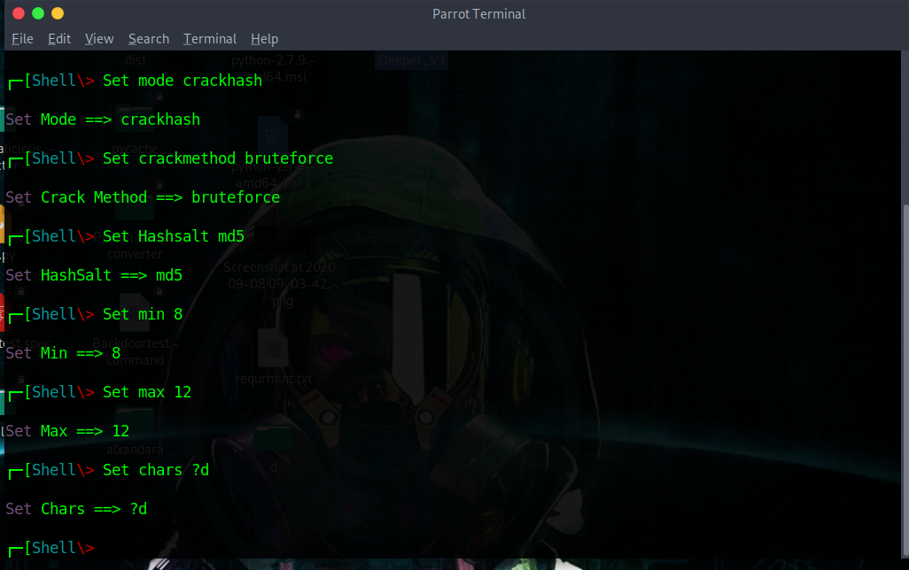
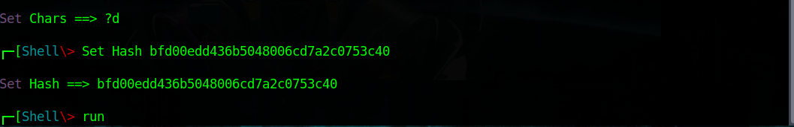

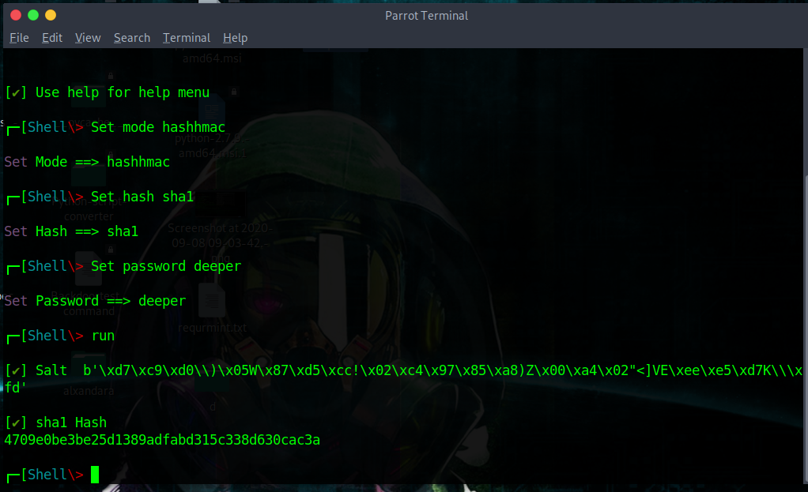

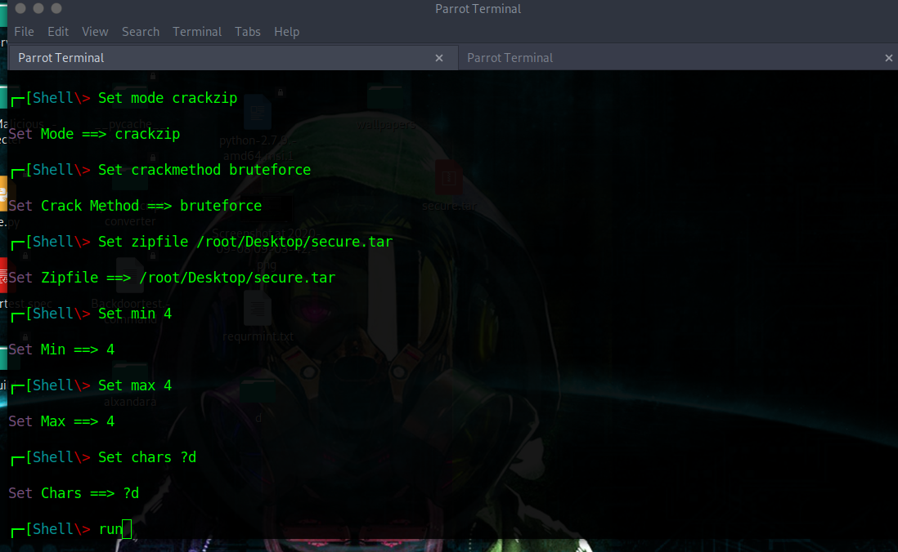
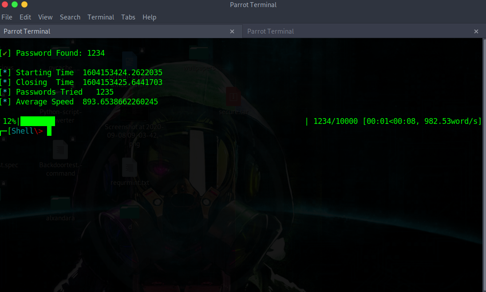
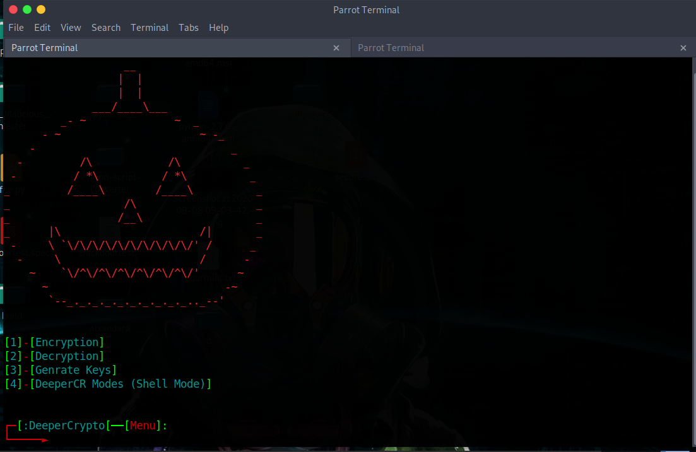
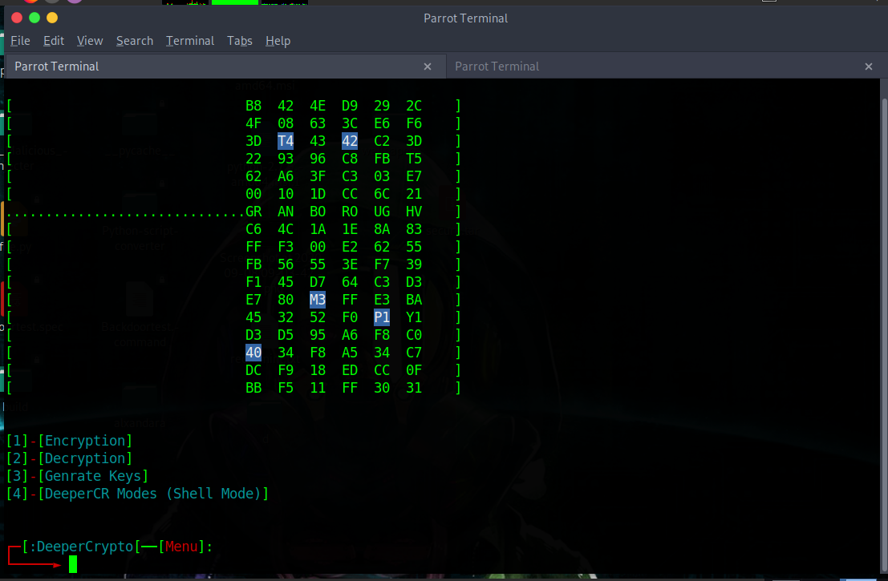
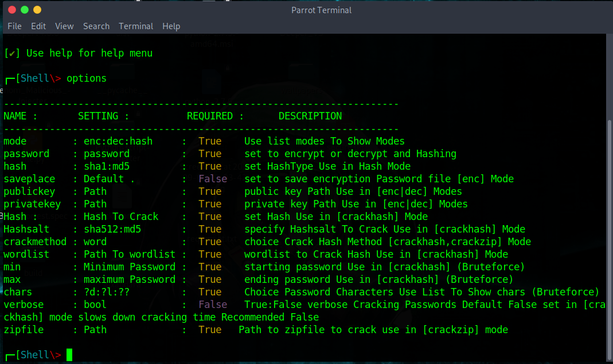
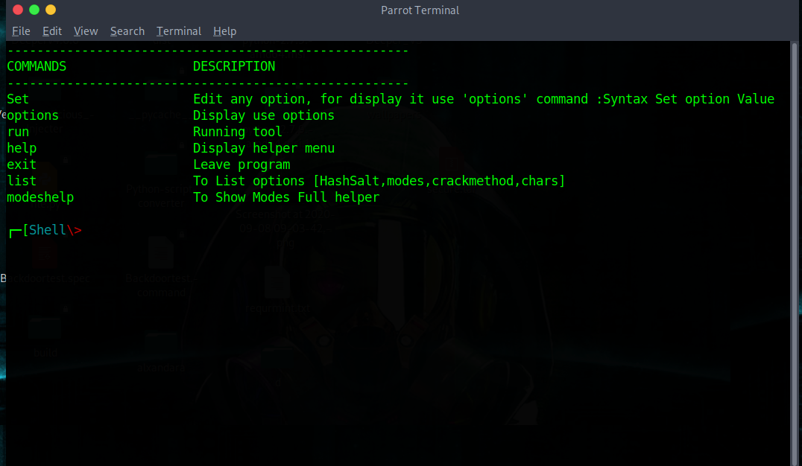

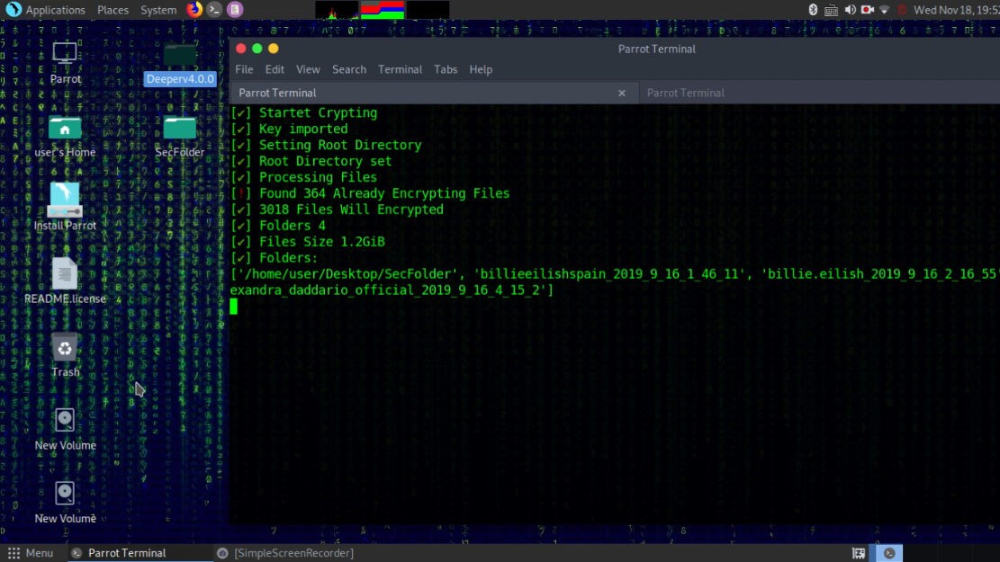
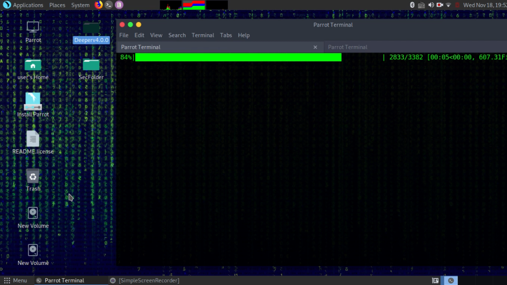
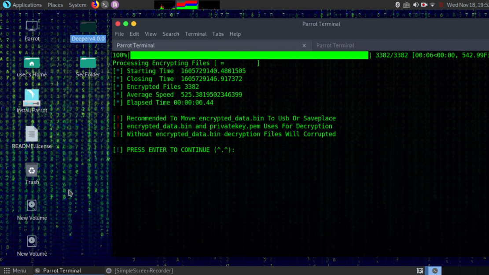

[

