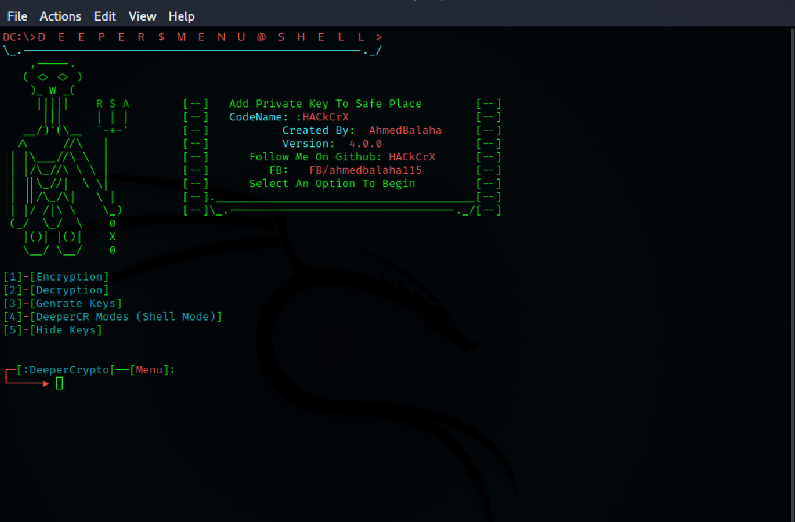
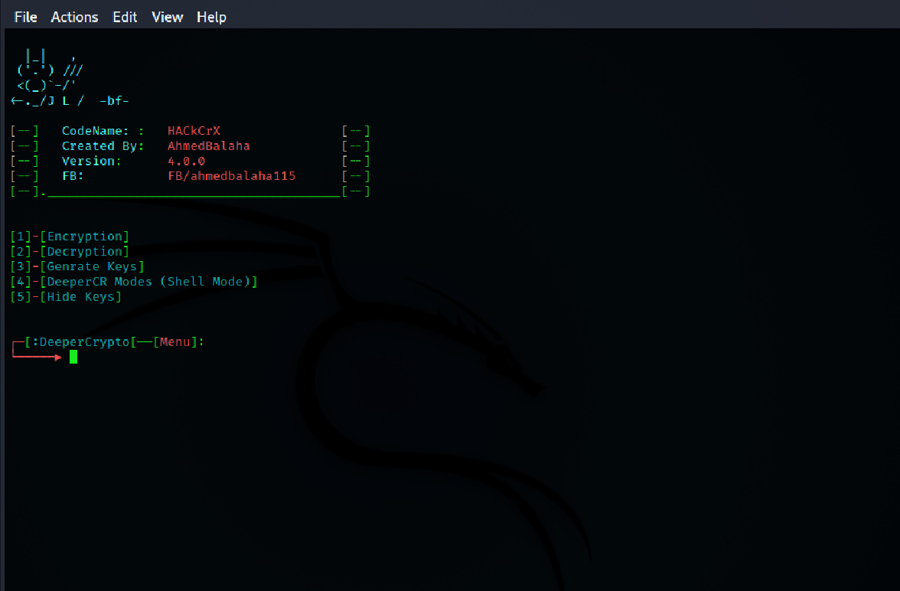
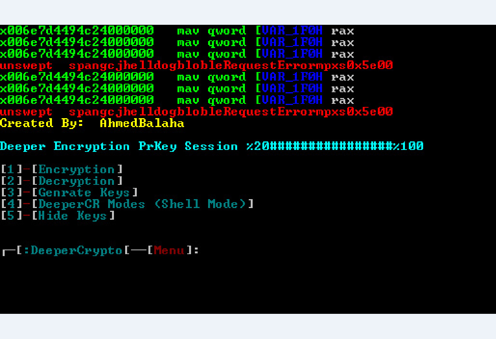

# deeperv4

Deeper V4
## FEATURES :
* [+]  Encrypt file or files in folder or subfolders or Partition or usb !
* [+] encription with Progress bar !
* [+] Fast encription !
* [+] Auto Replace Spaces And Chars Like & () In Files 
* [+] Encrypting Files With Aes and Rsa Public And Private Keys 
* [+] SHELL mode !
* [+] Fast Hash Cracker Bruteforce & Dict Attack !
* [+] Hashing Password !
* [+] Hashing Password with hashhmac !
* [+] encript Password !
* [+] crack zipfile Bruteforce & Dict Attack !
* [+] Style Banners !
* [+] Hide Keys !

## REQUIREMENTS
...$ pip3 install -r requirements.txt
recommended install python 3.7.3

---------------------------------------------
Command in shell mode 
---------------------------------------------
$ Modes
hashhmac

hash

enc

dec

crackhash

crackzip

Syntax:
---------------------------------------------
$ Set mode enc : encript password

$ Set publickey path to publicKey

$ Set privatekey path to privateKey

$ Set Password test 

$ run
--------------------------------------------
$ Set mode dec : decrypt password

$ Set publickey path to publicKey

$ Set privatekey path to privateKey

$ Set Password test 

$ run
-------------------------------------------
ex hash mode :
------------------
Set mode hash 

Set hash md5

Set password test 

run 
------------------
ex crackhash mode dictionary:
-----------------------------
Set mode crackhash

Set crackmethod dictionary 

Set Hashsalt md5 

Set Hash bfd00edd436b5048006cd7a2c0753c40 

Set wordlist /home/root/Desktop/pwds.txt

Set verbose False

run
------------------------------------------
ex crackhash mode bruteforce:
-----------------------------
Set mode crackhash

Set crackmethod bruteforce 

Set Hashsalt md5 

Set Hash bfd00edd436b5048006cd7a2c0753c40 

Set min 8 

Set max 8 

Set chars ?d

run
-------------------------------------------

Setup:

Run python3 setup.py install

Updating Tool 

run python3 updater.py

System

Linux Windows 

   

[

[

